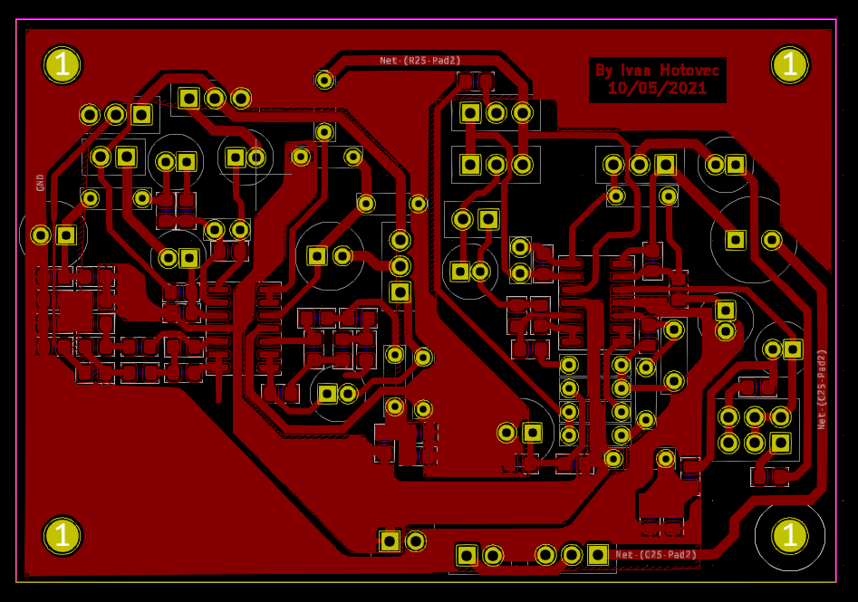
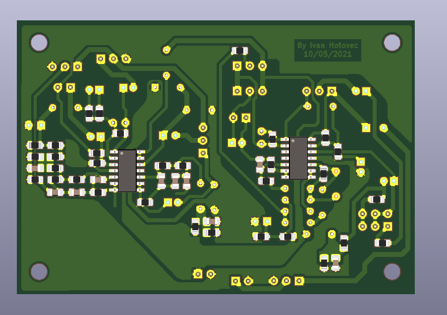
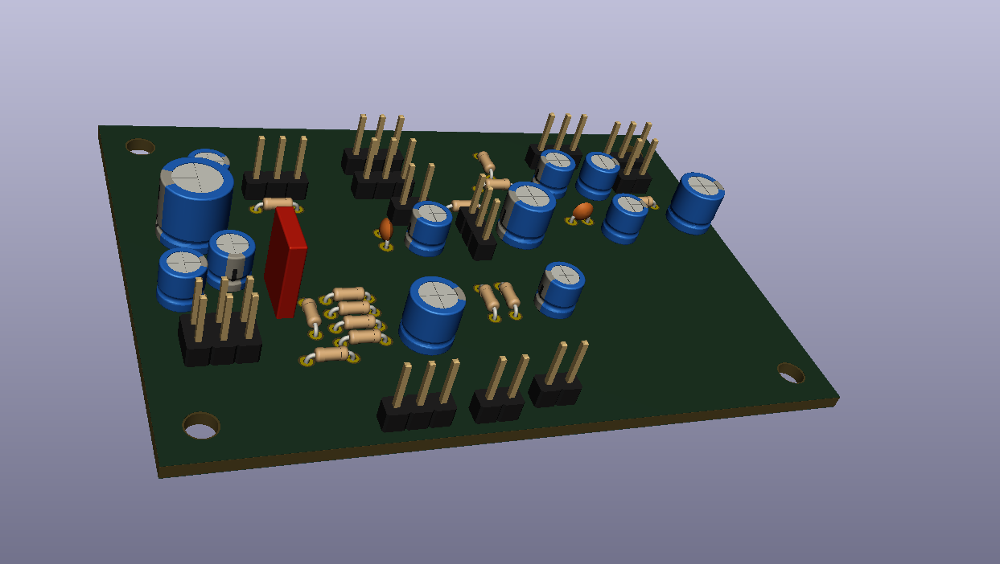
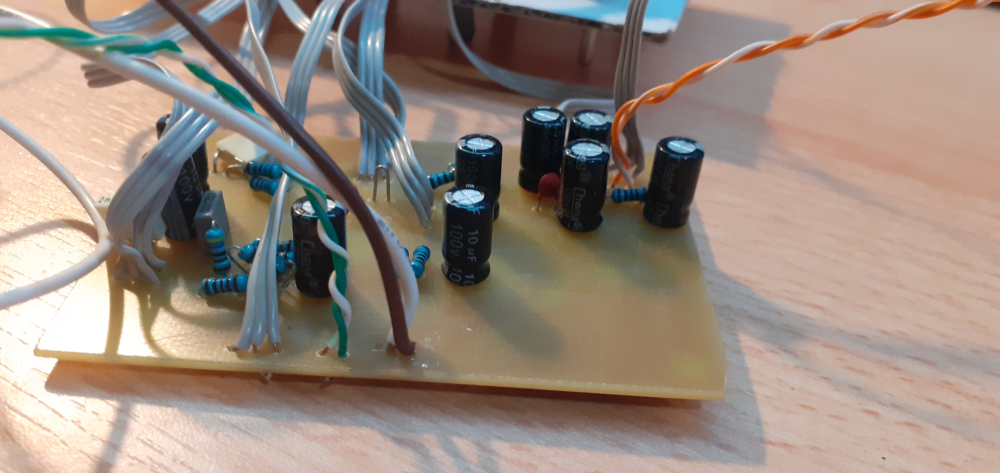
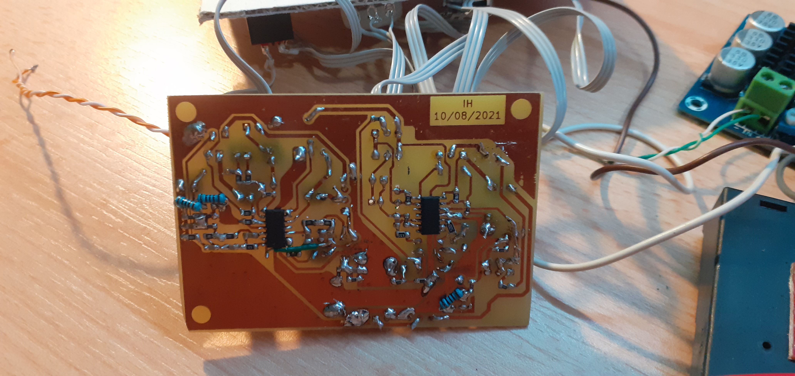
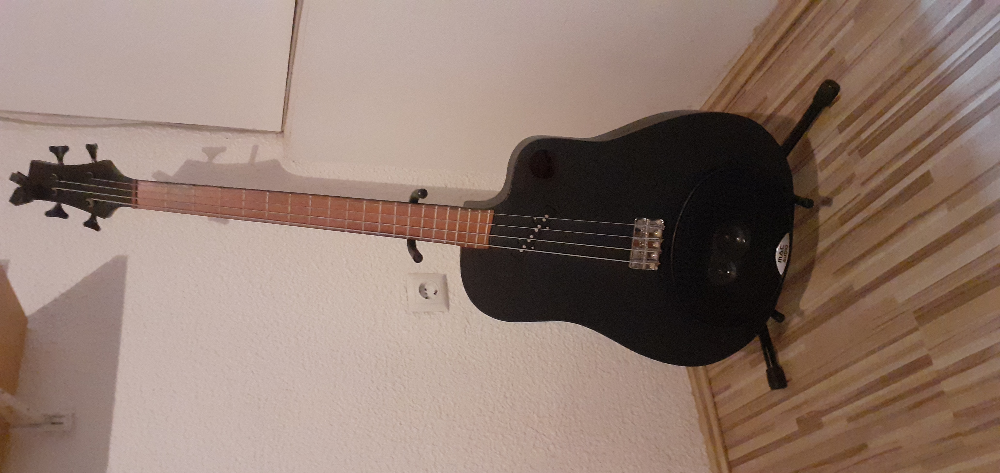

# Aktivna bass gitara s ugrađenim zvučnikom

Dizajn tiskane pločice napravljem pomoću KiCad-a.

Tiskana pločica dizajnirana je kao jednoslojna pločica radi lakšeg procesa jetkanja, a komponente su dijelom THT i SMD jer u trenutku izrade nije bilo pristupa drugačijim.

## Slike

Prikaz dizajna pločice

3D Prikaz

3D Prikaz

Izrađeni sklop

Izrađeni sklop

Kompletirana bass gitara
